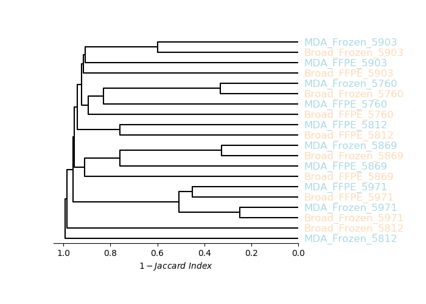
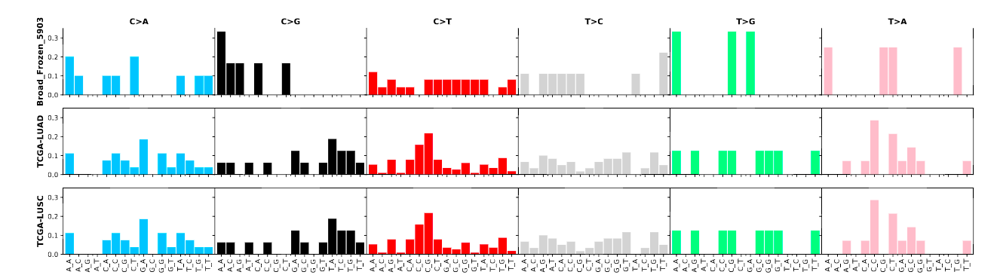
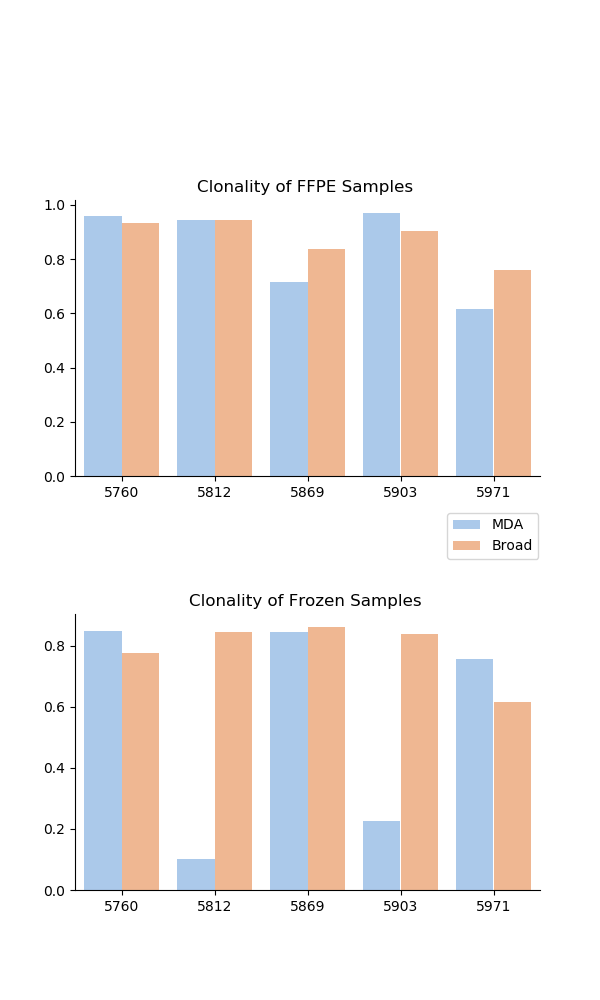
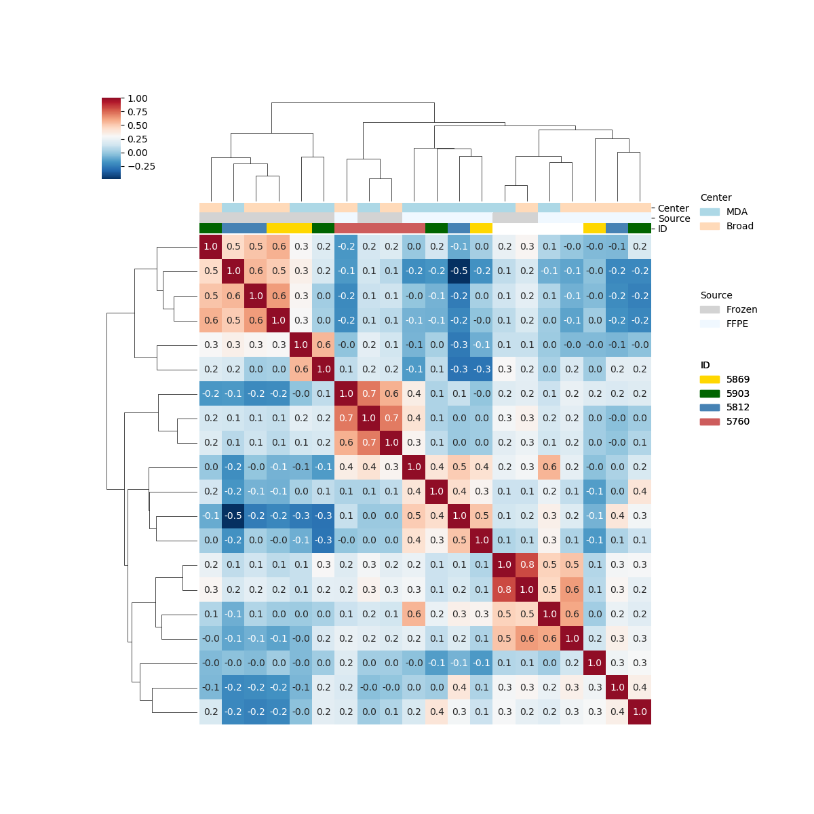
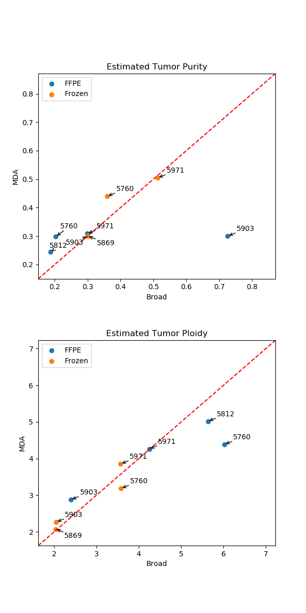

### Requirement
> Must use [vcf2maf](https://github.com/mskcc/vcf2maf) to convert vcf to maf file.

### Install

```powershell
git clone git@github.com:jingxinfu/cidc-vs.git
cd cidc-vs
pip install .
```

### Usage

>Visualization of WES harmonization 2
>Usage: 
>   cidc-vs /path/to/files  /path/to/output /path/to/fasta
>
>- Input: 
>  -  Path of folder for all files 
>  -  Path of folder for output figures
>  -  Path of folder for reference fasta
> 
>- Files nomenclature:
>     - Center_source_sampleID_tools_feature
>     - Options:    
>         Center: Broad, MDACC    
>         tools: Sentieon, GISTIC, Pyclone, Facets    
>         source: FFPE, Frozen   
>         feature: Mutation.Germline, Mutation.Somatic, Clonality, Purity, CNV   

#### Example
> Reference fasta file can either be downloaded from myc or gcloud
> 
> **gcloud**: `gsutil -m cp gs://immunotherapy/Reference/Homo_sapiens_assembly38.fasta* 	/path/to/fasta`
> 
> **myc**: `scp username@myc.dfci.harvard.edu:/cluster/asahu/mutation_calling/MDAnderson/ref/Homo_sapiens_assembly38.fasta* /path/to/fasta`
```shell
cidc-vs ../test/example/pilot_1/ test/ /path/to/fasta
```
### Input folder structure
```
|-- clonality    
|   |-- Broad_FFPE_5760.cluster.tsv    
|   |-- .....    
|   |-- MDA_FFPE_5760.cluster.tsv       
|   |-- ......    
|-- cnv    
|   |-- Broad.all_data_by_genes.txt    
|   |-- MDA.all_data_by_genes.txt        
|-- purity    
|   |-- Broad_FFPE_5760.Facets_output.txt    
|   |-- .....    
|   |-- MDA_FFPE_5760.Facets_output.txt    
|   |-- ......    
| -- somatic_mutation    
   |-- maf   
   |   |-- Broad_FFPE_5760.vep.maf   
   |   |-- ......   
   |   |-- MDA_FFPE_5760.vep.maf   
   |   |-- ...
   |-- vcf   
       |-- Broad_FFPE_5760.sentieon.vcf    
       |-- ......   
       |-- MDA_FFPE_5760.sentieon.vcf   
       |-- ......   
```
### Output example

#### Mutation clustering (TNsnv: Mutect1)



#### Mutation Profile



#### Clonality



#### Copy number variation



#### Tumor purity and ploidy



